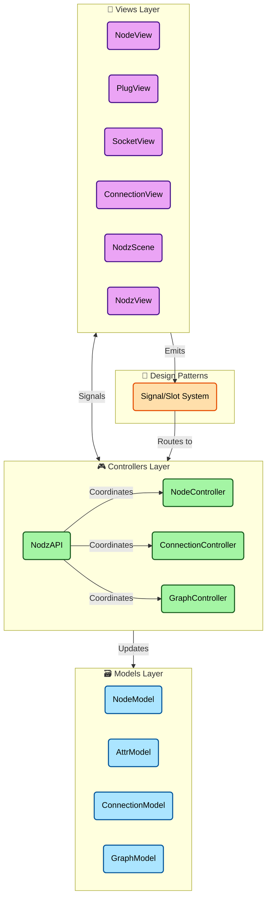

# Nodz - Node-Based Graph Editor


Nodz is a sophisticated, user-friendly Python library for creating node-based graphs with a clean MVC architecture. It provides a visual interface for building and managing complex node networks with type-safe connections between nodes through attributes (plugs and sockets).

Nodz is designed to be highly extensible and can be integrated into any Python application that needs visual node-based editing capabilities. The library outputs connections as structured data, making it easy to integrate with your application's data processing pipeline.

Nodz is fully customizable via configuration files that allow you to change colors, shapes, and behavior of nodes and connections.

***If you find any errors/bugs/flaws or anything bad, feel free to let me know so I can fix it for the next persons that would like to download nodz.***

***PLEASE MAKE SURE TO CREATE 1 PULL REQUEST PER ISSUE ! THIS IS EASIER AND CLEANER TO PROCESS***

Nodz is under the [MIT license](LICENSE.txt).

[WATCH DEMO HERE](https://vimeo.com/219933604)

## Architecture

Nodz is built with a clean **Model-View-Controller (MVC)** architecture that provides excellent separation of concerns and maintainability:

### Core Architecture Components



### Design Patterns Used

- **MVC Pattern**: Clean separation between data (Models), presentation (Views), and business logic (Controllers)
- **Facade Pattern**: `NodzAPI` provides a unified interface hiding the complexity of the underlying architecture
- **Signal/Slot Pattern**: Qt-based event system for loose coupling between components

### Key Architectural Features

- **Type Safety**: Comprehensive type checking system for connections between nodes
- **Extensible Design**: Plugin-ready architecture with preset system for customization
- **Performance Optimized**: Efficient Qt-based rendering with proper Z-ordering and selective updates
- **Error Handling**: Comprehensive exception hierarchy with descriptive error messages

## Requirements

The following needs to be installed:

- Python 3.9+
- pip
- pipenv (optional, but recommended)

### Dependencies

- `qtpy` - Qt abstraction layer
- `PySide6` - Qt bindings for Python

## Installation

```bash
git clone <repository-url>
cd nodz
pipenv install  # or pip install -e .
```

## Quick Start

```python
from nodz.main import create_nodz_view
from qtpy import QtCore, QtWidgets
import sys

# Create application
app = QtWidgets.QApplication(sys.argv)

# Create Nodz view
nodz = create_nodz_view()
nodz.setWindowTitle("My Node Editor")
nodz.resize(1000, 700)
nodz.show()

# Access the unified API
api = nodz.api

# Create nodes
input_node = api.create_node("Input", position=QtCore.QPointF(100, 100))
process_node = api.create_node("Process", position=QtCore.QPointF(300, 100))
output_node = api.create_node("Output", position=QtCore.QPointF(500, 100))

# Create attributes
api.create_attribute(input_node, "data_out", plug=True, socket=False, data_type=str)
api.create_attribute(process_node, "data_in", plug=False, socket=True, data_type=str)
api.create_attribute(process_node, "result_out", plug=True, socket=False, data_type=str)
api.create_attribute(output_node, "data_in", plug=False, socket=True, data_type=str)

# Create connections
api.create_connection("Input", "data_out", "Process", "data_in")
api.create_connection("Process", "result_out", "Output", "data_in")

# Run application
sys.exit(app.exec_())
```

## Configuration

Nodz comes with a default [configuration file](nodz/default_config.json) that controls the visual appearance and behavior of the node editor. The configuration file supports:

- Node and attribute visual presets
- Colors, fonts, and styling
- Grid settings and viewport behavior
- Connection appearance and behavior
- Keyboard shortcuts and interaction settings

The configuration file is automatically loaded, and you can create custom presets for different node types and visual themes.

## Features

### Interactive Features

- **Multi-selection**: Shift/Ctrl+click for additive/subtractive selection
- **Connection Management**: Visual connection drawing with real-time compatibility feedback
- **Grid Snapping**: Hold 'S' to snap nodes to grid
- **Auto Layout**: Press 'L' for automatic hierarchical layout
- **Connection Cutting**: Alt+drag to cut multiple connections at once
- **Viewport Controls**: 'A' to frame all, 'F' to frame selection, 'H' to toggle help

### Keyboard Shortcuts

```
Del/Backspace : Delete selected nodes
F             : Frame selected items (or all items if nothing selected)
A             : Frame all nodes in view
L             : Auto-layout graph hierarchically
S (hold)      : Snap selected nodes to grid
H             : Toggle help overlay
Alt+Drag      : Cut connections with line
Ctrl+G        : Create group from selected nodes
Ctrl+Shift+G  : Remove selected groups
```

### Advanced Features

- **Type-safe Connections**: Automatic validation of data types between plugs and sockets
- **Graph Analysis**: Cycle detection, execution order calculation, dependency tracking
- **Save/Load**: Complete graph serialization to JSON format
- **Undo/Redo Ready**: Architecture supports command pattern implementation
- **Plugin System**: Extensible preset system for custom node types

### Node Groups

Node groups allow you to visually organize related nodes within colored, labeled containers. Groups help manage complex graphs by providing logical grouping and collective manipulation of nodes.

**Visual Representation:**
- Semi-transparent colored background box
- Title label displayed at the top of the group
- Automatically resizes to encompass all member nodes
- Groups are rendered behind nodes to keep nodes as primary interactive elements

**Creating Groups:**
- Select one or more nodes
- Press `Ctrl+G` to create a group from the selection
- Groups are automatically named and colored (customizable via API)

**Behavior:**
- Moving a group moves all member nodes together
- A node can only belong to one group at a time
- Deleting a group preserves the member nodes
- When a grouped node is deleted, it is automatically removed from its group

**Example Usage:**

```python
# Create nodes
api.create_node("Input", position=QtCore.QPointF(100, 100))
api.create_node("Process", position=QtCore.QPointF(300, 100))
api.create_node("Output", position=QtCore.QPointF(500, 100))

# Group related nodes
api.create_node_group("Processing Pipeline", ["Input", "Process"])

# Add another node to existing group
api.add_to_node_group("Processing Pipeline", "Output")

# Customize group color (RGBA)
api.set_group_color("Processing Pipeline", (65, 105, 225, 80))

# List all groups
groups = api.list_node_groups()
print(f"Groups: {groups}")

# Get nodes in a group
members = api.get_group_members("Processing Pipeline")
print(f"Members: {members}")
```

## Unified API Reference

Nodz provides a comprehensive unified API through the `NodzAPI` class that handles all graph operations:

### Node Operations

```python
# Create nodes
node_name = api.create_node(name, preset="node_default", position=None, alternate=True, **kwargs)

# Manage nodes
api.delete_node(node_name)
api.rename_node(old_name, new_name)
nodes = api.get_node_names()
exists = api.node_exists(node_name)

# Position management
position = api.get_node_position(node_name)
api.set_node_position(node_name, QtCore.QPointF(x, y))
```

### Attribute Operations

```python
# Create attributes
api.create_attribute(
    node_name,
    attr_name,
    index=-1,
    preset="attr_default",
    plug=True,
    socket=True,
    data_type=None,
    plug_max_connections=-1,
    socket_max_connections=1,
    **kwargs
)

# Manage attributes
api.delete_attribute(node_name, attr_name)
api.edit_attribute(node_name, attr_name, new_name=None, new_index=None)
attrs = api.get_node_attributes(node_name)
exists = api.attribute_exists(node_name, attr_name)
```

### Connection Operations

```python
# Create connections
api.create_connection(source_node, source_attr, target_node, target_attr)

# Manage connections
api.delete_connection(source_node, source_attr, target_node, target_attr)
connections = api.get_connections()  # Returns list of (src_node, src_attr, tgt_node, tgt_attr)
exists = api.connection_exists(source_node, source_attr, target_node, target_attr)
node_connections = api.get_node_connections(node_name)
```

### Graph Operations

```python
# Save/Load
api.save_graph(file_path)
api.load_graph(file_path)
api.clear_graph()

# Analysis
stats = api.get_graph_stats()  # Returns {"nodes": count, "connections": count, "attributes": count}
evaluation = api.evaluate_graph()  # Returns list of ("source.attr", "target.attr") tuples
errors = api.validate_graph()  # Returns list of validation error messages
```

### Advanced Graph Analysis

```python
# Dependency analysis
upstream_nodes = api.get_upstream_nodes(node_name)
downstream_nodes = api.get_downstream_nodes(node_name)

# Cycle detection
cycles = api.find_cycles()  # Returns list of cycles (each cycle is a list of node names)

# Execution order
try:
    execution_order = api.get_execution_order()  # Returns topologically sorted node list
except ValueError:
    # Graph contains cycles
    pass
```

### Group Operations

```python
# Create a group from selected nodes
group_info = api.create_node_group(name, members=None, color=None)  # Returns dict with group info

# Manage groups
api.delete_node_group(group_name)  # Returns bool
api.rename_node_group(group_name, new_name)  # Returns bool

# Manage group membership
api.add_to_node_group(group_name, node_names)  # Returns bool
api.remove_from_node_group(group_name, node_names)  # Returns bool

# Query groups
groups = api.list_node_groups()  # Returns list of group names
issues = api.validate_node_group(group_name)  # Returns list of validation issues

# Additional helpers
members = api.get_group_members(group_name)  # Get nodes in a group
group = api.get_node_group(node_name)  # Get group containing a node (or None)
api.set_group_color(group_name, (r, g, b, a))  # Set group RGBA color
exists = api.group_exists(group_name)  # Check if group exists
```

### Utility Methods

```python
# Logging control
api.set_logging_level('DEBUG')  # or logging.DEBUG
level = api.get_logging_level()

# Viewport control (when using NodzView)
framing = api.get_viewport_framing()
api.set_viewport_framing(framing)
```

## Error Handling

Nodz provides a comprehensive exception hierarchy for robust error handling:

```python
from nodz.controllers import (
    NodzError,              # Base exception
    NodeError,              # Node-related errors
    NodeNotFoundError,      # Node doesn't exist
    NodeExistsError,        # Node already exists
    AttributeError,         # Attribute-related errors
    AttributeNotFoundError, # Attribute doesn't exist
    ConnectionError,        # Connection-related errors
    IncompatibleTypesError, # Type mismatch in connections
    # Group-related errors
    NodeGroupError,         # Base group exception
    GroupNotFoundError,     # Group doesn't exist
    GroupExistsError,       # Group already exists
    NodeAlreadyInGroupError,# Node is already in another group
)

try:
    api.create_connection("NodeA", "output", "NodeB", "input")
except NodeNotFoundError as e:
    print(f"Node not found: {e.node_name}")
except IncompatibleTypesError as e:
    print(f"Type mismatch: {e.source_type} -> {e.target_type}")
except NodzError as e:
    print(f"General error: {e}")

# Group error handling example
try:
    api.create_node_group("MyGroup", ["NodeA", "NodeB"])
except GroupExistsError as e:
    print(f"Group already exists: {e.group_name}")
except NodeAlreadyInGroupError as e:
    print(f"Node '{e.node_name}' is already in group '{e.existing_group}'")
```

## Examples

See the demo files for comprehensive examples:

- [`nodz_mvc_demo.py`](nodz_mvc_demo.py) - Basic MVC architecture demonstration
- [`nodz_unified_api_demo.py`](nodz_unified_api_demo.py) - Comprehensive API usage examples

## Integration

Nodz can be easily integrated into larger applications:

1. **Embedding**: The `NodzView` can be embedded in any Qt application
2. **Data Binding**: Connect graph evaluation to your data processing pipeline
3. **Custom Presets**: Define application-specific node and attribute presets
4. **Signal Handling**: Connect to the comprehensive signal system for application integration

## Use Cases

Nodz is perfect for applications requiring visual node-based interfaces:

- **Visual Programming Environments**
- **Data Processing Pipelines**
- **Shader/Material Editors**
- **Workflow Automation Tools**
- **Scientific Computing Interfaces**
- **Audio/Video Processing Tools**
- **Game Logic Editors**

## Contributing

Contributions are welcome! Please ensure:

- One pull request per issue
- Follow the existing code style and architecture patterns
- Add tests for new functionality
- Update documentation as needed

## License

Nodz is released under the [MIT License](LICENSE.txt).
